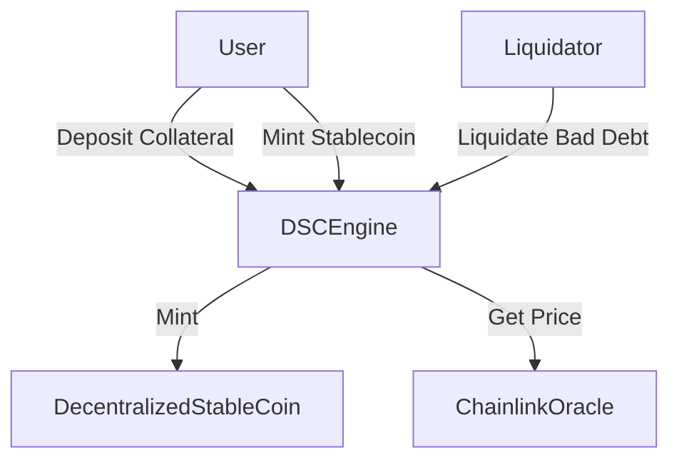

# Decentralized Stablecoin Protocol


A minimal, exogenous, crypto-backed stablecoin protocol designed with a focus on **Reliability, Mathematical Solvency, and Security**.

This project implements a decentralized stablecoin system similar to the architecture of MakerDAO (DAI) or Liquity, built using the Foundry framework. It features a complete algorithmic minting engine, a liquidation system for protocol solvency, and a rigorous test suite featuring Handler-based Invariant Fuzzing.

---

## Architecture

The system is governed by three core components:

1. **`DecentralizedStableCoin.sol`**: An ERC20 token that represents the stablecoin. It is "governed" by the Engine and cannot mint tokens on its own.
2. **`DSCEngine.sol`**: The core logic contract. It handles:
   - Collateral Deposits (wETH, wBTC)
   - Minting & Burning of Stablecoin
   - Health Factor Calculations
   - Liquidation Logic
3. **Chainlink Oracles**: Provides reliable, decentralized price feeds to ensure the protocol is always aware of the collateral's USD value.

### System Flow



---

## Economic Mechanics

- **Peg:** 1 Token = $1.00 USD.
- **Collateral:** Exogenous (wETH, wBTC).
- **Minting Mechanism:** Algorithmic. Users can only mint stablecoins if they have enough collateral to back it.
- **Collateralization Ratio:** \> 150% (Min Health Factor of 1.0).
- **Liquidation:** If a user's Health Factor drops below 1.0, liquidators can pay off the user's debt in exchange for their collateral + a liquidation bonus.

---

## Testing & Security (The "Deep Dive")

This project goes beyond standard unit testing by implementing **Stateful Invariant Fuzzing**. This mathematically proves that the protocol remains solvent under chaotic conditions.

### The Invariant: "The Golden Rule"

The system is considered secure only if:
Total Collateral Value > Total Stablecoin Supply

### Fuzzing Strategy

Instead of random inputs (Stateless Fuzzing), this project uses a **Handler-Based Architecture** to guide the fuzzer:

1. **Handler Contract (`Handler.t.sol`):**

   - Acts as a proxy to the Engine.
   - Maintains "Ghost Variables" to track users with valid deposits.
   - Constrains inputs to prevent unreasonable reverts (e.g., ensuring a user deposits before attempting to mint).
   - Includes a `liquidate` funnel to simulate market cleanup during volatility.

2. **Invariant Suite (`Invariants.t.sol`):**

   - Executes random sequences of `deposit`, `mint`, `redeem`, and `liquidate`.
   - Asserts the Golden Rule after _every single transaction_.

### Running the Tests

1. **Standard Unit Tests**

```bash
forge test
```

2. **Invariant Fuzz Tests (Solvency Check)**

```bash
forge test --mt invariant_protocolMustHaveMoreValueThanTotalSupply
```

3. **Coverage Report**
   To see the extent of the testing:

```bash
forge coverage
```

---

## Getting Started

### Prerequisites

- [Git](https://git-scm.com/book/en/v2/Getting-Started-Installing-Git)
- [Foundry](https://getfoundry.sh/)

### Installation

```bash
git clone https://github.com/obinnafranklinduru/crypto-backed-stablecoin.git
cd crypto-backed-stablecoin
make install
make build
```

### Deployment (Local Anvil Chain)

```bash
# Start a local node
make anvil

# Deploy contracts
make deploy-anvil
```

---

## Future Roadmap

- **Governance Integration:** Implementing a governance token to allow the community to vote on parameters (e.g., Liquidation Threshold, Liquidation Bonus).
- **Dynamic Stability Fees:** Adding an interest rate model to generate protocol revenue.
- **Oracle Redundancy:** Integrating fallback oracles (e.g., Uniswap TWAP) to prevent single points of failure.

---

## Author

**Obinna Franklin Duru (BinnaDev)**
_Smart Contract & Backend Engineer_

> "Building with Reliability, Thoughtfulness, and Excellence."

[Let's Connect](https://binnadev.vercel.app)
